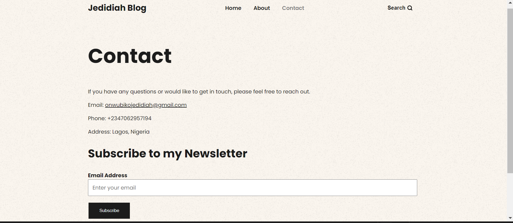

# J-blog😊😍😊

## Stack -- NodeJs, Express, EJS & MongoDB Blog

[j-blog.com](https://j-blog-dlw9.onrender.com/)

## You need:

- NodeJs
- Database (MongoDB) Free Cluster

## Create .env file

Create a .env file to store your credentials. Example below:

```
PORT=5000
MONGODB_URI=mongodb+srv://Jedybrown:<password>@cluster-nodejs-blog.cl4hvbg.mongodb.net/blog?retryWrites=true&w=majority&appName=Cluster-nodejs-blog
MONGODB_PASSWORD=<password>

JWT_SECRET=1Dj3$8uKvL#p9X*G9z!Y7s$E@dM5n^tT
```

## Installation

To install and run this project - install dependencies using npm and then start your server:

```
$ npm install
$ npm run dev
```

### You need:

NodeJs
Database (MongoDB) Free Cluster

### Create .env file

Create a .env file to store your credentials. Example below:

### makefile

```
PORT=5000
MONGODB_URI=mongodb+srv://Jedybrown:<password>@cluster-nodejs-blog.cl4hvbg.mongodb.net/blog?retryWrites=true&w=majority&appName=Cluster-nodejs-blog
MONGODB_PASSWORD=<password>
JWT_SECRET=1Dj3$8uKvL#p9X*G9z!Y7s$E@dM5n^tT
```

### Installation

To install and run this project - install dependencies using npm and then start your server:

```
$ npm install
$ npm run dev
```

### Deployment to Render

To deploy this application to Render from your GitHub repository, follow these steps:

### Create a new service on Render:

```
Name: J-blog
Language: NodeJs
Branch: main
Region: Oregon (US West)
Root Directory: ./
Build Command: npm install
Start Command: node app.js
```

### Add environment variables:

```
PORT=5000
MONGODB_URI=mongodb+srv://Jedybrown:<password>@cluster-nodejs-blog.cl4hvbg.mongodb.net/blog?retryWrites=true&w=majority&appName=Cluster-nodejs-blog
MONGODB_PASSWORD=<password>
JWT_SECRET=1Dj3$8uKvL#p9X*G9z!Y7s$E@dM5n^tT
```

### Deploy your application:

Once you have configured the service with the above settings and environment variables, Render will automatically deploy your application from the specified branch in your GitHub repository.

### Website

[jedidiahsolomon.com](https://jedidiahsolomon.vercel.app/)

## Images



